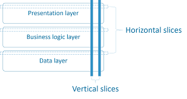

# Features

We try to make different features as *horizontal slices*.

**A feature should represent end-to-end functionality.** This functionality is a
slice of the whole, but it should be complete on its own!

Try to assemble your work in a way that you move from one working state to another
quickly. Don't leave not working states for long! Ideally, all commits contain a
working set of functionality (it compiles, it doesn't crash, etc.).

Our feature set can be summarized as the following.