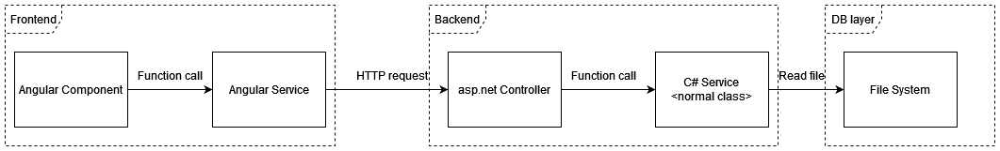

# evoPlanet


The evoPlanet project's GitHub repository can be found [here](https://github.com/bbalage/evoPlanet/).

The project is about creating a web based orbital simulator, where users can create arbitrary systems of stellar objects, and can make them move according to the Newtonian rules of gravity.

The created stellar setups can be shared online with other users, and they can also simulate the gravity systems.

---

## Plans
- [Features](/evoPlanet/features)

---

## First task

Create an end-to-end flow of querying a single planet system! See the image below!



---

## Workflow
1. The Angular Component calls the service (either due to a button push or automatically).
2. The Angular Service makes an HTTP request to the backend. It sends the name of the planet system it is asking for.
3. The asp.net Controller receives the request, and calls on the C# Service, passing the name of the planet system as
an argument.
4. The C# Service looks for a JSON file (in a given directory), which contains the data of the planet system. It reads
the file data and returns it to the Controller.
5. The Controller responds with the PlanetSystem's data.
6. The Angular Service receives the data, and returns it to the Angular Component.
7. The Component renders the planet system data in a webpage (a simple text is enough).

---

## Notes

Most important data of a planet:

```
position: x,y,z
velocity: x,y,z
radius: number
mass: number
name: string
```
