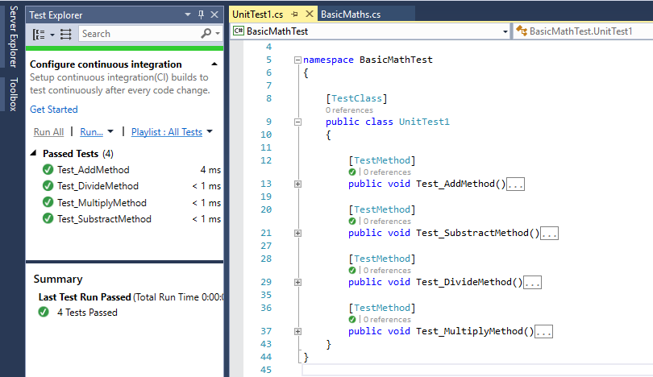
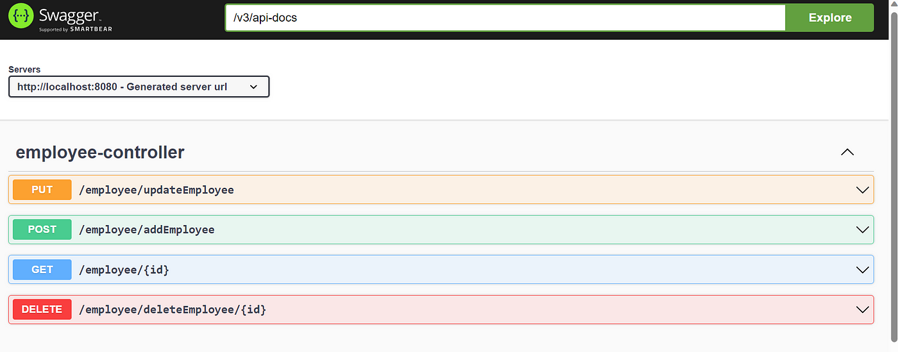

# evoPlanet

## 🌕 Introduction

The evoPlanet project's GitHub repository can be found [here](https://github.com/bbalage/evoPlanet/).

The project is about creating a web-based orbital simulator, where users can create arbitrary systems of stellar objects and make them move according to the Newtonian rules of gravity.

The created stellar setups can be shared online with other users, and they can also simulate the gravity systems.

---

## 💡 Our ideas

- [ER](/evoPlanet/er)
- [Frontend](/evoPlanet/frontend)

---

## ✏️ Our tasks

Create an end-to-end flow of querying a single planet system! See the image below!


---

## 🎯 Workflow

1. **The Angular Component** calls the service (either due to a button push or automatically).
2. **The Angular Service** makes an HTTP request to the backend, sending the name of the planet system it is asking for.
3. **The ASP.NET Controller** receives the request and calls on the C# Service, passing the name of the planet system as an argument.
4. **The C# Service** looks for a JSON file and DB (in a given directory) containing the data of the planet system. It reads the file data and returns it to the Controller.
5. **The Controller** responds with the PlanetSystem's data.
6. **The Angular Service** receives the data and returns it to the Angular Component.
7. **The Component** renders the planet system data on a webpage (a simple text display is sufficient).

---

## 💻 Technnologies

### **Angular**


Angular is an open-source, JavaScript framework written in TypeScript. Google maintains it, and its primary purpose is to develop single-page applications. 
  
### **ASP.NET**

  

ASP.NET is an open source web framework, created by Microsoft, for building modern web apps and services with .NET. ASP.NET is cross platform and runs on Windows, Linux, macOS, and Docker.

---

## 📐 Test

### **Unit Test**



Unit testing is a software testing technique where individual units or components of a software are tested in isolation. The main goal is to validate that each unit of the software works as designed. A “unit” refers to the smallest testable part of the software, which can be a function, method, or class.

---

## 📚 Development agreements

### **SOLID principles**
  
1.  **S: Single Responsibility Principle** (SRP)
1.  **O: Open-closed Principle** (OCP)
1.  **L: Liskov substitution Principle** (LSP)
1.  **I: Interface Segregation Principle** (ISP)
1.  **D: Dependency Inversion Principle** (DIP)

**S: Single Responsibility Principle**

Every software module should have only one reason to change.

Example:

```csharp
  public class UserService
  {
     EmailService _emailService;
     DbContext _dbContext;
     public UserService(EmailService aEmailService, DbContext aDbContext)
     {
        _emailService = aEmailService;
        _dbContext = aDbContext;
     }
     public void Register(string email, string password)
     {
        if (!_emailService.ValidateEmail(email))
           throw new ValidationException("Email is not an email");
           var user = new User(email, password);
           _dbContext.Save(user);
           emailService.SendEmail(new MailMessage("myname@mydomain.com", email) {Subject="Hi. How are you!"});
     }
  }
```

**O: Open-closed Principle**

A software module/class is open for extension and closed for modification.

Example:

```csharp
  public abstract class Shape
  {
     public abstract double Area();
  }
  public class Rectangle : Shape
  {
     public double Height {get;set;}
     public double Width {get;set;}
     public override double Area()
     {
        return Height * Width;
     }
  }
  public class Circle : Shape
  {
     public double Radius {get;set;}
     public override double Area()
     {
        return Radius * Radus * Math.PI;
     }
  }
  public class AreaCalculator
  {
     public double TotalArea(Shape[] arrShapes)
     {
        double area=0;
        foreach(var objShape in arrShapes)
        {
           area += objShape.Area();
        }
        return area;
     }
  }
```

**L: Liskov substitution Principle**

You should be able to use any derived class instead of a parent class and have it behave in the same manner without modification.

Example:

```csharp
  public interface IReadableSqlFile
  {
     string LoadText();
  }
  public interface IWritableSqlFile
  {
     void SaveText();
  }
  public class SqlFile : IWritableSqlFile, IReadableSqlFile
  {
     public string FilePath {get;set;}
     public string FileText {get;set;}
     public string LoadText()
     {
        /* Code to read text from sql file */
     }
     public void SaveText()
     {
        /* Code to save text into sql file */
     }
  }
  public class SqlFileManager
  {
     public string GetTextFromFiles(List<IReadableSqlFile> aLstReadableFiles)
     {
        StringBuilder objStrBuilder = new StringBuilder();
        foreach(var objFile in aLstReadableFiles)
        {
           objStrBuilder.Append(objFile.LoadText());
        }
        return objStrBuilder.ToString();
     }
     public void SaveTextIntoFiles(List<IWritableSqlFile> aLstWritableFiles)
     {
        foreach(var objFile in aLstWritableFiles)
        {
           objFile.SaveText();
        }
     }
  } 
```

**I: Interface Segregation Principle**

That clients should not be forced to implement interfaces they don't use. Instead of one fat interface, many small interfaces are preferred based on groups of methods, each serving one submodule.

Example:

```csharp
  public interface IProgrammer
  {
     void WorkOnTask();
  }
  public interface ILead
  {
     void AssignTask();
     void CreateSubTask();
  }
  public class Programmer : IProgrammer
  {
     public void WorkOnTask()
     {
        //code to implement to work on the Task.
     }
  }
  public class Manager : ILead
  {
     public void AssignTask()
     {
        //Code to assign a Task
     }
     public void CreateSubTask()
     {
     //Code to create a sub taks from a task.
     }
  }
  public class TeamLead : IProgrammer, ILead
  {
     public void AssignTask()
     {
        //Code to assign a Task
     }
     public void CreateSubTask()
     {
        //Code to create a sub task from a task.
     }
     public void WorkOnTask()
     {
        //code to implement to work on the Task.
     }
  }
```

**D: Dependency Inversion Principle**

One should depend upon abstractions, not concretions. High-level modules/classes should not depend on low-level modules/classes.

Example:

```csharp
  public interface IMessage
  {
      void SendMessage();
  }
  public class Email : IMessage
  {
      public string ToAddress { get; set; }
      public string Subject { get; set; }
      public string Content { get; set; }
      public void SendMessage()
      {
          //Send email
      }
  }
  public class SMS : IMessage
  {
      public string PhoneNumber { get; set; }
      public string Message { get; set; }
      public void SendMessage()
      {
          //Send sms
      }
  }
  public class Notification
  {
      private ICollection<IMessage> _messages;
  
      public Notification(ICollection<IMessage> messages)
      {
          this._messages = messages;
      }
      public void Send()
      {
          foreach(var message in _messages)
          {
              message.SendMessage();
          }
      }
  }
```

---

## 🔧 Development tools

### **Visual Studio 2022**
  

  
### **MongoDB Compass**


### **Postman**


### **SwaggerUI**


  
